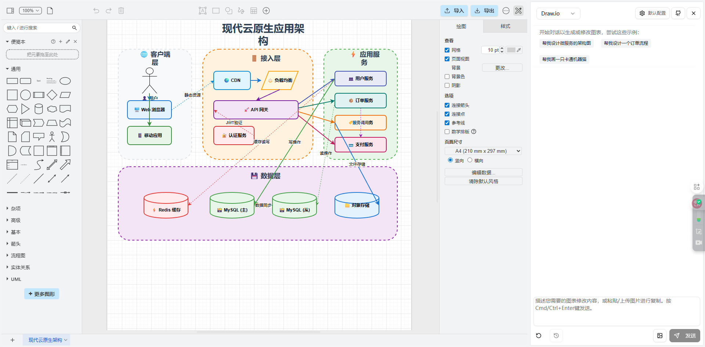
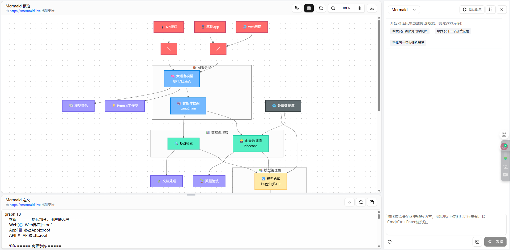
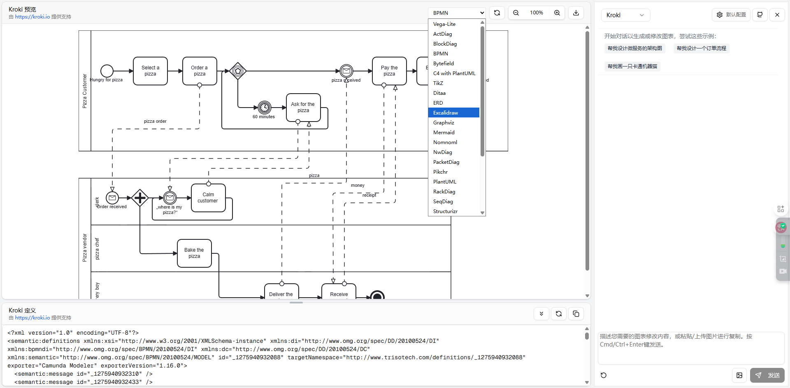
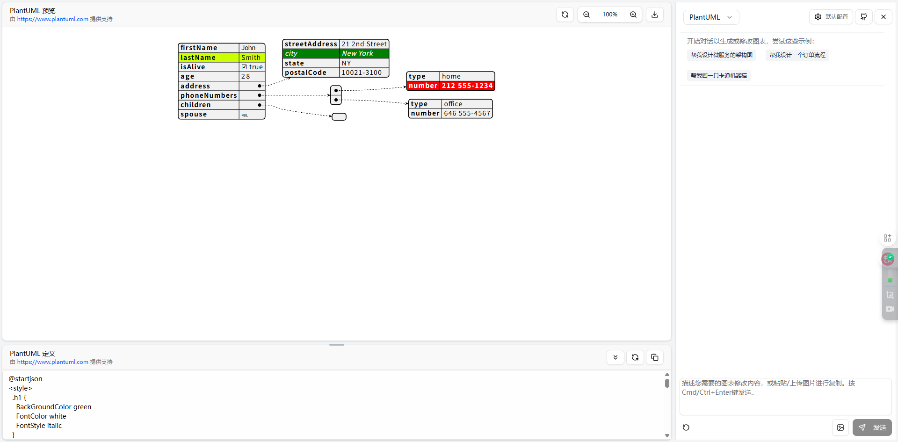
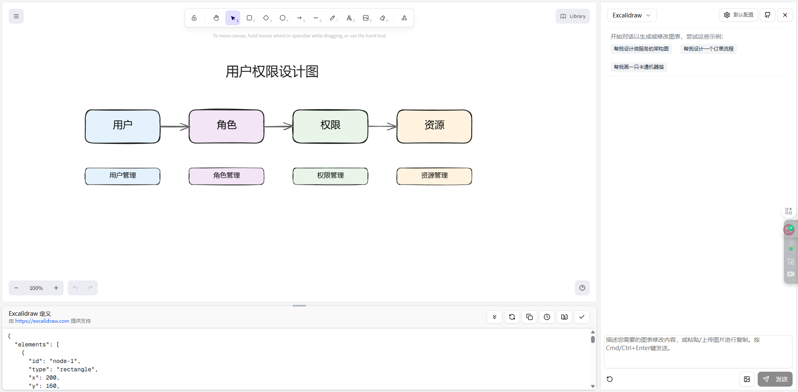
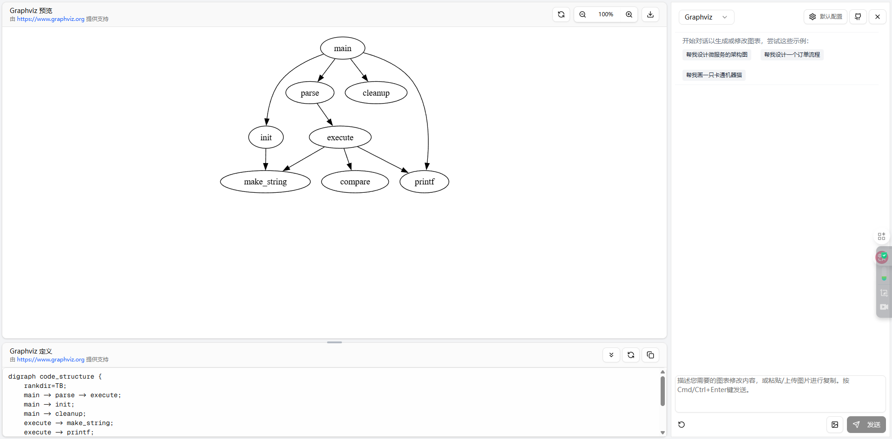

# AI 智能绘图（ai-draw-studio）

[English](README_en.md) | 中文

> **本项目是 [shenpeiheng/ai-smart-draw](https://github.com/shenpeiheng/ai-smart-draw)（MIT）的 fork**，在此基础上做了以下增强：
>
> - **DeepSeek V4 系列模型支持**：`deepseek-v4-flash`（快速）、`deepseek-v4-pro`（强力）、`deepseek-v4-flash-vision-exp`（视觉），支持自定义 API 端点（OpenAI 兼容），多配置管理 + 能力路由（含图片的请求自动切到视觉模型）。
> - **注入 [Agents365-ai/drawio-skill](https://github.com/Agents365-ai/drawio-skill)（MIT）内容资产**：`skills/drawio-skill/` 的 XML 规范 / 图表类型预设 / 样式速查随请求注入模型上下文；`search_shapes`（10,446 个官方形状精确 style）与 `ai_icon`（AI/LLM 品牌 logo）两个服务端工具，杜绝"猜 shape 变空白框"。
> - **视觉开关**：配置视觉模型后启用图片上传/粘贴，未配置时自动禁用。
>
> 上游在线演示：https://ai-smart-draw.vercel.app/

一个基于 Next.js 构建的智能绘图应用程序，利用 AI 的强大功能创建和操作各种类型的图表，包括 Draw.io (diagrams.net)、Mermaid、PlantUML、Excalidraw，以及通过自然语言命令支持 20 多种其他图表格式。








## 🌟 主要功能

- **AI 驱动的图表创建**: 将自然语言描述转换为专业图表
- **多格式支持**: 支持 Draw.io XML、Mermaid、PlantUML、Excalidraw，以及通过 Kroki 支持 20 多种其他格式
- **智能编辑**: 通过对话式 AI 提示修改现有图表
- **实时预览**: 在与 AI 交互时查看更改
- **版本历史**: 跟踪和恢复图表的先前版本
- **可折叠聊天面板**: 展开或折叠聊天界面以最大化工作区
- **灵活渲染**: 具有回退机制的多种渲染选项
- **模型配置**: 直接从浏览器自定义 AI 模型

## 🎯 支持的图表类型

### Draw.io (diagrams.net)
使用 AI 驱动的 XML 生成和修改功能创建和编辑专业流程图、过程图和复杂可视化图表。

### Mermaid
在专用工作区中生成流程图、序列图、甘特图等，并提供实时 SVG 预览。

### PlantUML
内置渲染代理，支持 plantuml.com、kroki.io 或自定义端点创建 UML 图表。

### Excalidraw
结合 AI 辅助的徒手风格绘图，用于有机图表创建。

### Graphviz
使用 DOT 语言语法创建图形图表。Graphviz 通过 kroki.io 服务提供支持，该服务提供强大的图形可视化功能。

### Kroki (20 多种格式)
使用 kroki.io 服务在各种格式中生成图表，通过单一界面支持：

- **PlantUML**: UML 图表、活动图、序列图等
- **Mermaid**: 流程图、序列图、甘特图等
- **BPMN**: 业务流程建模符号，用于工作流图
- **Graphviz**: 图形可视化和网络图
- **BlockDiag**: 方框图
- **C4-PlantUML**: 软件架构图
- **Ditaa**: ASCII 艺术到图像转换
- **Erd**: 实体关系图
- **Vega/Vega-Lite**: 数据可视化
- **以及其他 15 多种格式**

## 🛠 工作原理

AI 智能绘图利用现代 Web 技术在自然语言和图表表示之间架起桥梁：

- **Next.js 应用路由器**: 具有服务器端渲染的快速、现代 React 框架
- **AI SDK 集成**: 与 OpenAI 兼容 API 的无缝通信
- **上下文感知提示**: 为每种图表类型设计的智能提示工程
- **实时流式传输**: 具有流式响应的即时反馈
- **格式特定工具**: 为每种图表格式设计的专用工具（[display_mermaid]、[display_plantuml] 等）

应用程序将您的自然语言请求转换为结构化图表代码，然后实时渲染。

## 🚀 入门指南

### 先决条件
- Node.js 18+
- npm 或 yarn

### 安装

1. 克隆仓库：
```bash
git clone https://github.com/shenpeiheng/ai-smart-draw.git
cd ai-smart-draw
```

2. 安装依赖：
```bash
npm install
# 或
yarn install
```

3. 在根目录创建 `.env.local` 文件。您可以使用 `env.example` 作为模板：
```bash
cp env.example .env.local
```

然后使用您的 OpenAI 凭据更新 `.env.local`。

### OpenAI 配置

- `OPENAI_API_KEY` (必需): 来自您 OpenAI 账户的密钥
- `OPENAI_MODEL` (可选): 默认为 `gpt-4o-mini`，如果您喜欢其他已发布的变体可以覆盖
- `OPENAI_BASE_URL` (可选): 默认为 `https://api.openai.com/v1`；如果您自托管代理或网关，请设置此项

示例片段：
```bash
OPENAI_API_KEY="sk-your-key"
# OPENAI_MODEL="gpt-4o-mini"
# OPENAI_BASE_URL="https://api.openai.com/v1"
```

#### 可选：从浏览器配置

- 点击任何工作区标题中的 **模型设置** 按钮，覆盖当前浏览器的 API 密钥、基础 URL 或模型。值存储在 `localStorage` 中，仅在您提交聊天请求时发送到服务器
- 留空任何字段以回退到上述服务器端环境变量
- 使用 **拉取列表** 按钮调用 `/api/models` 助手，将当前凭据转发到 `GET /models` 并列出可选择的模型 ID

4. 运行开发服务器：
```bash
npm run dev
```

5. 在浏览器中打开 [http://localhost:3000](http://localhost:3000) 查看应用程序
    - `/` -> Draw.io (XML 工作流、图表历史、文件上传)
    - `/mermaid` -> Mermaid (由您配置的 OpenAI 兼容模型驱动的实时预览 + 定义卡)
    - `/plantuml` -> PlantUML (具有远程预览的基于文本的图表)
    - `/excalidraw` -> Excalidraw (由相同模型驱动的自由形式画布)
    - `/kroki` -> Kroki (由 kroki.io 驱动的多格式图表)
    - `/graphviz` -> Graphviz (由 kroki.io 驱动的图形可视化图表)

## 🌐 用户界面功能

### 可折叠聊天面板
- 切换聊天面板以最大化您的工作区
- 折叠时，浮动按钮可快速访问以恢复聊天面板
- 流畅的动画提供无缝用户体验

### 响应式设计
- 针对桌面和笔记本电脑使用进行了优化
- 移动友好的界面和适当的消息

### 统一导航
- 在不同图表类型之间轻松切换
- 所有图表工作区的一致界面

## 🚀 部署

部署 Next.js 应用的最简单方法是使用 Next.js 创建者提供的 [Vercel 平台](https://vercel.com/new)。

查看 [Next.js 部署文档](https://nextjs.org/docs/app/building-your-application/deploying)了解更多详情。

或者您可以使用此按钮进行部署。
[](https://vercel.com/new/clone?repository-url=https%3A%2F%2Fgithub.com%2Fshenpeiheng%2Fai-smart-draw)

## 📁 项目结构

```
app/                  # Next.js 应用路由和页面
  api/                # 不同图表类型的 API 路由
  [diagram-type]/     # 每种图表类型的独立页面
components/           # React 组件
  ui/                 # 可重用的 UI 组件
  [feature]/          # 特定功能的组件
contexts/             # React 上下文提供者
lib/                  # 实用函数和助手
public/               # 静态资源，包括示例图片
skills/               # vendor 的 Agents365-ai 图表 skill 家族（MIT）
  drawio-skill/       # XML 规范 / 脚本 / 形状索引 / 样式预设
  mermaid-skill/
  excalidraw-skill/
  plantuml-skill/
```

## ❓ 常见问题（Q&A）

### Q1：`Agents365-ai/drawio-skill` 在本项目中是如何起作用的？

它**不是一个被"运行"的插件或 MCP 服务**，而是两类资产被"搬进"了 Web 应用：

1. **作为提示词知识注入**（`lib/skill-assets.ts`）：`buildDrawioSkillContext()` 返回约 1.5KB 的精简参考（XML 骨架、形状关键字、连线规则、配色、图类型提示），拼进 drawio 聊天路由的系统提示（`app/api/chat/route.ts`）。
   > 注意：最初注入的是完整 13KB 的 `xml-authoring.md`，但会让 deepseek 推理模型"思考爆炸"（1/5 成功率），故改为 1.5KB 精简版（6/6 成功率）。

2. **作为确定性脚本由后端路由调用**：

| skill 脚本 | 项目实现 | 暴露方式 |
|---|---|---|
| `shapesearch.py`（1 万官方形状 style）| TS 重写 `lib/shape-search.ts`，读 `data/shape-index.json.gz` | `search_shapes` 工具 |
| `aiicons.py`（AI 品牌 logo）| TS 重写，读 `data/lobe-icons.json` | `ai_icon` 工具 |
| `autolayout.py`（Graphviz 布点）| `python3` 调用 | `layout_diagram` 工具 + 「自动布局」按钮 |
| `restyle.py`（换主题）| `python3` 调用 | `apply_style` 工具 + 「样式」下拉 |
| `c4.py`（C4 多页下钻）| `python3` 调用 | `c4_diagram` 工具 |
| `sqlerd/tfimports/openapiimports/pyimports/jsimports` | `python3` 调用 | 文件上传 → `/api/import` |

3. **集成进模型工具调用**：这些能力注册为 AI SDK tools，模型在对话中可直接调用（例如"画 AWS 架构图用官方图标"会自动调 `search_shapes`）。

**没用的部分**：skill 依赖的 draw.io 桌面 CLI（headless 导出 PNG）被 iframe 浏览器端导出替代，因此本项目**无需安装 draw.io 桌面版**。

### Q2：视觉自检是如何运作的，有什么作用？

这是 drawio-skill「Step 5 Self-Check」的浏览器版——**让模型"看见"自己生成的图，检查并修复布局问题**（生成 XML 的文本模型是"盲"的）。

**流程**（`components/chat-panel.tsx` + `app/api/selfcheck/*`）：

```
生成完图表(display_diagram)
  → ① 视觉自检开关开着 & 配了视觉模型？
       ↓ 是
  → ② 从画布导出 PNG（contexts/diagram-context.tsx 的 exportPng）
  → ③ PNG 发给 deepseek-v4-flash-vision-exp（/api/selfcheck）
       检查：节点重叠 / 标签截断 / 箭头脱靶 / 连线穿节点 / 越界 / 边标签重叠
       → 返回 JSON 问题清单
  → ④ 有问题？问题 + 单元格目录发给文本模型（/api/selfcheck-fix）
       生成 id 级修复指令（move/nudge/relabel/restyle/delete）
       → lib/xml-edit.ts 确定性应用 → 回到②复查（最多 2 轮）
  → ⑤ 聊天里反馈：自检通过 / 已自动修复 N 处 / 列出问题清单
```

**作用**：质量兜底——文本模型靠"脑补"坐标，容易重叠/截断/连线乱；视觉模型用真实渲染图挑错，抓到的是肉眼可见的问题，并尝试自动修复。

**边界**：检测这半段可靠；自动修复这半段受上游模型限制（约 50-67% 成功率，带 3 次重试，失败时降级为列出问题清单供手动修改）。

## ✅ 待办事项

- [x] 允许 LLM 修改 XML 而不是每次都从头生成
- [x] 提高形状流式更新的流畅性
- [x] 添加可折叠聊天面板以更好地利用工作区

## 📄 许可证

该项目基于 MIT 许可证。

## ⭐ 星标历史

[](https://www.star-history.com/?repos=eason-zhang-ai%2Fai-draw-studio&type=date&legend=top-left)
